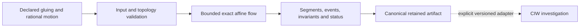

# Polygon Dynamics

**Follow trajectories across connected polygonal spaces while retaining crossings, topology and stopping conditions.**

| NET micro-tool | Identity and scope |
| --- | --- |
| User-facing name | **Polygon Dynamics** |
| Proposed NET operation | `geometry.polygon_dynamics` |
| Implementation repository | `Translation-Surface-Dynamics-Explorer` |
| Existing import and CLI module | `translation_surface_dynamics` |
| Current boundary | Bounded rational straight-line flow on connected square-tiled translation surfaces |

`geometry.polygon_dynamics` is the agreed NET-facing target, not a newly
registered command. The current provider supports square-tile permutation
gluings, **not arbitrary polygon gluings or vertex continuation**. Use its
existing CLI and Python API below. The broader tool label does not widen the
implemented request contract.

NET owns installation, revision binding, session composition and dispatch;
this provider owns topology validation and trajectory computation. Evidence,
operation specifications, execution attempts and verification records remain
distinct. Repository URLs, imports, schemas, digests and licence terms are
unchanged by this documentation update.

## Organization

**Notation Systems Inc** is a scientific computing and systems engineering company developing computational instruments, software, and interactive environments for understanding and building physical and virtual systems.

Its development direction connects measurement, state estimation and sensor fusion, scientific modelling, simulation, and execution, from materials and machines to interactive worlds.

As the parent organization, it operates through three divisions:

| Division | Focus |
| --- | --- |
| **Notations Gaming** | Games, graphics, world building, interactive environments, and gameplay simulation |
| **Notations Manufacturing** | Design, machinery integration, process development, fabrication, and production systems |
| **Notations Laboratories** | Research and experimental validation in scientific computing, measurement, physics and chemistry modelling, materials, and simulation |

**Repository role:** **Notations Laboratories**. Polygon Dynamics follows bounded rational straight-line flow on connected square-tiled translation surfaces while retaining crossings and stopping conditions. It supplies a geometric dynamics reference for scientific computing and virtual-system experiments. Arbitrary polygon gluing, vertex continuation, and physical application validity remain outside the current implemented contract.

[Notations Engineering Terminal (CIW)](https://github.com/giasonpooni/Notations-Engineering-Terminal) · [Stack map](https://github.com/giasonpooni/Notations-Engineering-Terminal/blob/main/docs/STACK.md) · [Component role](docs/STACK_ROLE.md) · [Request and result contract](docs/CONTRACT.md)

**Status: implemented bounded reference.** This Python provider follows declared
straight-line flow across connected square-tiled translation surfaces. Right and
up tile permutations specify the gluings; left and down use their inverses. The
included three-square L-shaped surface has genus two, so this operation supports
more than the flat torus.

Each segment and boundary-intersection time is derived by rational arithmetic
from the declared affine motion. Results retain the exact request, gluing
validation, genus and vertex classes, directed crossing events, segments,
recomputed invariants, stopping policies and canonical SHA-256 digests. This
bounded mathematical computation does not establish ergodicity, physical
accuracy, or cryptographic proof of execution.

## Run an experiment

Requires Python 3.11 or newer; there are no runtime dependencies.

```sh
python -m pip install .
python -m translation_surface_dynamics < examples/request.json
```

The second command uses POSIX shell redirection. In PowerShell:

```powershell
Get-Content -Raw examples/request.json | python -m translation_surface_dynamics
```

The installed API:

```python
import json
from translation_surface_dynamics import run, validate_request

with open("examples/request.json", encoding="utf-8") as source:
    request = validate_request(json.load(source))
result = run(request)
print(result["status"], result["gluing_validation"]["genus"])
print(result["final_state"], result["artifact_digest"])
```

The example finishes at time `3`, in tile `1` at `["1/4", "5/6"]`, after four
gluing events. [The torus-cover fixture](examples/torus-cover.json) supplies a
genus-one analytical comparison with different tile transitions.

## Completion and bounds

| Status | Meaning |
| --- | --- |
| `completed` | Requested duration covered, including a single edge gluing at the endpoint. |
| `stopped_at_vertex` | Two edges reached simultaneously; no continuation through the vertex chosen. |
| `event_budget_exhausted` | Next boundary reached, but its gluing not applied. |

Partial results retain a valid prefix and explicit pending edges. A corner or
budget stop at the requested endpoint is still partial even when `remaining` is
`"0"`. Regular and singular vertices both stop. Starts must be strictly interior.

The profile accepts 1–32 tiles, 0–1,024 edge events, canonical reduced rational
strings with 64-bit numerators and denominators, and duration and direction
component magnitudes at most 1,024. Arithmetic growth beyond 256 bits fails
without an artifact. The CLI accepts at most 32 KiB and rejects duplicate keys,
nonfinite values and unsupported fields. See the [full contract](docs/CONTRACT.md).

## Verify the implementation

```sh
python -m unittest discover -s tests -v
python -m pip install "setuptools>=77" wheel
python scripts/check_installed.py
```

Tests exercise analytical torus unfolding, genus two, inverse flow, noninvolutive
gluings, rational near-corner ordering, explicit stops, malformed input and digest
recomputation. The installed-wheel check runs the same algorithm from a separate
virtual environment outside the source tree. CI runs source and installed-wheel
checks on Windows and Linux.

## Component boundary



The solid path is implemented here. Notations Engineering Terminal (CIW) owns
installation, revision binding, investigation retention and presentation through
its separately versioned adapter. A current provider checkout does not imply
that a deployed workbench has installed it. General polygon gluings, arbitrary
real directions, vertex continuation, Jacobi fields and moduli-space exploration
remain outside this profile. See [scope](docs/SCOPE.md) and
[contributor invariants](CONTRIBUTING.md).

## License

MIT. See [LICENSE](LICENSE).
