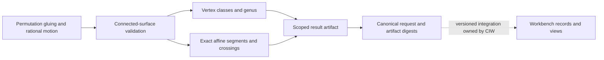

# Translation Surface Dynamics Explorer in the instrumentation stack

Notation Systems develops computational instrumentation and evidence infrastructure.
This component owns **bounded trajectory dynamics on declared translation
surfaces**. The [stack map](https://github.com/atomtrapping/Notations-Systems-Terminal/blob/main/docs/STACK.md)
locates the public components.

## Current boundary

| Property | Scope |
| --- | --- |
| Implementation | Exact rational affine flow on connected square-tiled surfaces, including higher genus |
| Operation | `tsde.square-tiled-flow.v1` |
| Inputs | Right/up permutations, interior tile coordinates, direction, duration and event budget |
| Outputs | Exact request, digests, topology, segments, directed events, invariants and completion status |
| Workbench connection | CIW owns its explicit adapter and exact provider revision; this package supplies the standalone contract |

The [contract](CONTRACT.md) specifies coordinates, arithmetic, limits and stops.
Physical units, measurement uncertainty and physical validity are not inferred
from dimensionless unit squares.

Solid arrows are implemented here. The dotted boundary requires the separate CIW
adapter and provider binding. Digests identify retained content; they are not
proofs of execution or physical admission decisions. A partial prefix is never
represented as a completed requested trajectory.

## Interoperability

`translation_surface_dynamics.run(request)` and `validate_request(request)` are
the API. The CLI accepts one bounded JSON request on stdin and emits one canonical
JSON result. An adapter must preserve the exact request, operation identity,
partial status and digests; it may impose smaller resource budgets. Repeated
executions can have the same result digest. Invocation or occurrence identity
belongs to the caller and must not be inferred from a content digest.

Display names and repository locations do not rename packages, schemas,
operation IDs, retained keys or historical runtime pins. CIW integrations use
the exact revisions named in their manifests and operating guides. A provider's
current default branch is not a substitute for that binding.

## Technical references

- [Overview](../README.md), [contract](CONTRACT.md), [scope](SCOPE.md), [contributor invariants](../CONTRIBUTING.md)
- [Surface dynamics: square-tiled surfaces](https://flatsurf.github.io/surface-dynamics/examples/square_tiled_surfaces.html)
- [Origami: mathematical background](https://ag-weitze-schmithusen.github.io/Origami/doc/chap1_mj.html)

Private customer state, deployment configuration and calibration knowledge remain
outside this public description. Licenses and source-data rights remain
controlling; a shared stack identity changes neither licenses nor visibility.
